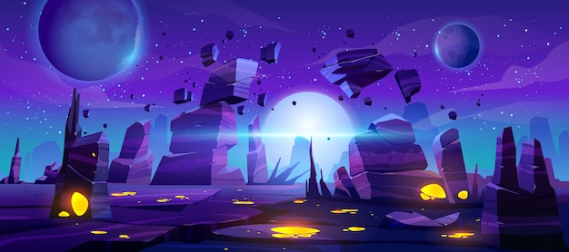

# Space Shooter Game

A visually stunning and highly immersive 2D space shooter game built with Python and Pygame. Control your spaceship, shoot enemies, collect power-ups, and try to survive as long as possible!

*Last updated: March 27, 2025*
*Current version: 0.3.7*



## Features

- Smooth spaceship controls with responsive gameplay
- Rich audiovisual experience with custom graphics and sound effects
- Multiple enemy types with unique behaviors and visuals
- Power-up system with three types of upgrades and visual effects
- Progressive difficulty system that keeps the challenge fresh
- Boss battles with unique attack patterns and projectiles
- Weapon power levels with visual feedback
- Health and shield system with animations
- Scoring system with high score tracking
- 60 FPS gameplay with optimized rendering
- Game over screen with restart option
- Immersive background music and sound effects
- Dynamic explosion animations
- Visual health bar and power indicators
- Pause functionality
- Star background effect when playing without background image
- Player damage visual feedback
- Detailed game UI with FPS counter and shield timer
- Performance optimization system with dirty rectangle rendering
- Advanced collision detection with spatial hash grid
- Real-time performance monitoring (toggle with 'M' key)

## Installation

1. Clone this repository:
```bash
git clone https://github.com/Mahdiglm/space-shooter.git
cd space-shooter
```

2. Install the required dependencies:
```bash
pip install -r requirements.txt
```

## How to Play

1. Run the game:
```bash
python main.py
```

2. Controls:
- LEFT ARROW: Move spaceship left
- RIGHT ARROW: Move spaceship right
- SPACEBAR: Shoot bullets
- P: Pause/unpause the game
- M: Toggle performance metrics display
- R: Restart game after game over
- ESC: Quit the game

3. Enemy Types:
- Regular Enemies (Red): Standard enemies
- Fast Enemies (Blue): Faster but more fragile, with horizontal movement
- Tank Enemies (Green): Slower but tougher, with more health
- Boss Enemy (Yellow): Appears at 1000 points, shoots projectiles, has complex movement patterns

4. Power-ups:
- Health (Green): Restores 20 health points
- Power (Blue): Increases weapon power level
- Shield (Yellow): Temporary invulnerability for 5 seconds
- Rapid Fire (Purple): Increases firing rate for 8 seconds
- Double Points (Orange): Doubles all points earned for 10 seconds

5. Weapon Power Levels:
- Level 1: Single shot
- Level 2: Double shot
- Level 3: Triple shot

6. Objective:
- Shoot enemies to score points
- Collect power-ups to enhance your abilities
- Avoid collisions with enemies and boss projectiles
- Try to survive as long as possible
- Defeat the boss enemy for bonus points
- Beat your high score

7. Scoring:
- Regular Enemy: 10 points
- Fast Enemy: 15 points
- Tank Enemy: 25 points
- Boss Enemy: 150 points

8. Difficulty:
- Game becomes progressively harder over time
- Enemy speed increases with difficulty
- Boss appears at 1000 points
- Try to achieve the highest score possible!

## Development Roadmap

Our development plan for Space Shooter is organized into near-term, mid-term, and long-term goals:

### Short-term Goals (v0.4.x)
- Add a proper title screen with game logo and menu options
- Implement multiple player ships with different characteristics
- Add screen transitions between game states
- Create a dedicated settings menu for audio/visual adjustments
- Implement persistent high score leaderboard

### Mid-term Goals (v0.5.x)
- Design and implement 3 distinct game levels with unique backgrounds and enemy patterns
- Add mini-boss encounters at the end of each level
- Create a progression system with unlockable ships and weapons
- Implement screen-clearing "bomb" special ability
- Add dynamic weather/environment effects (space storms, asteroid fields)

### Long-term Goals (v1.0 and beyond)
- Develop a story mode with mission objectives and narrative
- Add cooperative multiplayer support for 2 players
- Create custom level editor for community content
- Implement advanced visual effects (particle systems, lighting)
- Port to additional platforms (web, mobile, desktop apps)

### Technical Improvements
- Convert to Entity Component System architecture
- Implement asset streaming for larger levels
- Create an advanced AI system for more engaging enemies
- Add gamepad/controller support
- Improve UI scalability for different screen resolutions

## Game Assets

- Graphics and UI elements are sourced from OpenGameArt.org (CC0 Public Domain)
- Sound effects and background music are sourced from OpenGameArt.org (CC0 Public Domain)
- All assets are properly licensed and attributed to their respective sources

## Latest Updates (v0.3.7)

- Added comprehensive technical documentation in new ARCHITECTURE.md file
- Created FAQ.md with answers to common player and developer questions
- Added Development Roadmap to the README.md
- Enhanced code documentation with detailed inline comments
- Improved overall code readability and organization

## Documentation

Space Shooter includes several documentation files to help users and developers:

- **README.md**: General overview, features, and installation instructions
- **ARCHITECTURE.md**: Technical architecture, performance systems, and extension guides
- **FAQ.md**: Frequently asked questions for both players and developers
- **CONTRIBUTING.md**: Guidelines for contributing to the project
- **CHANGELOG.md**: Detailed history of changes and improvements

## Development

This project is open source and welcomes contributions! We have several ways you can help:

### Reporting Issues
- Use our [Issue Tracker](https://github.com/Mahdiglm/space-shooter/issues) to report bugs
- Follow the bug report template for detailed information
- Include system information and steps to reproduce

### Suggesting Features
- Submit feature requests through our [Issue Tracker](https://github.com/Mahdiglm/space-shooter/issues)
- Use the feature request template to describe your idea
- Explain why the feature would be beneficial

### Contributing Code
- Fork the repository
- Create a new branch for your feature
- Follow our coding standards
- Submit a pull request

### Documentation
- Help improve documentation
- Add comments to complex code
- Create tutorials or guides

For detailed guidelines, please check out our [Contributing Guidelines](CONTRIBUTING.md).

## License

This project is licensed under the MIT License - see the [LICENSE](LICENSE) file for details.

### Asset Licensing
All game assets (images, sounds, and fonts) are original works created for this project and are licensed under the MIT License. No third-party assets are used in this game.

## Acknowledgments

- Built with [Pygame](https://www.pygame.org/)
- Sound effects from [SoundJay](https://www.soundjay.com/)
- Inspired by classic space shooter games 